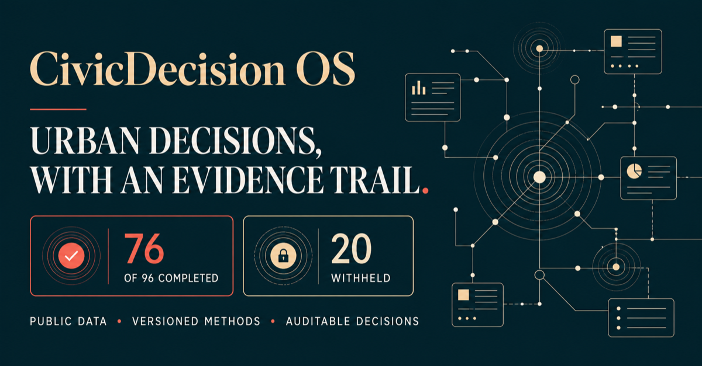
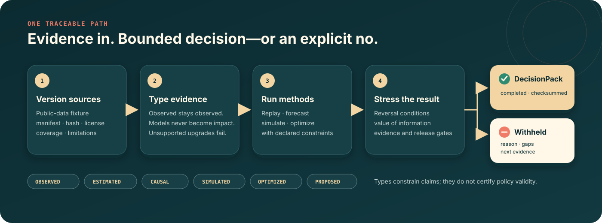
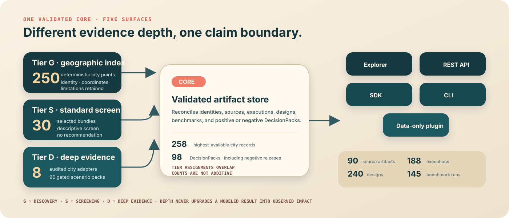

<p align="center">
  
</p>

<h1 align="center">CivicDecision OS</h1>

<p align="center">
  <strong>Compile public evidence, bounded methods, and policy constraints into a reviewable decision—or an explicit no.</strong><br>
  Evidence-typed urban analysis · reversible decisions · reproducible DecisionPacks
</p>

<p align="center">
  <a href="https://github.com/limingrui679-design/civicdecision-os/actions/workflows/ci.yml"></a>
  <a href="https://github.com/limingrui679-design/civicdecision-os/actions/workflows/codeql.yml"></a>
  <a href="https://github.com/limingrui679-design/civicdecision-os/releases/latest"></a>
  <a href="pyproject.toml"></a>
  <a href="LICENSE"></a>
</p>

<p align="center">
  <a href="https://civicdecision-os.limingrui2.chatgpt.site"><strong>Open the public walkthrough</strong></a>
  · <a href="#end-to-end-workflow">Workflow</a>
  · <a href="#start-in-three-steps">Run it locally</a>
  · <a href="#one-reference-case-two-honest-outcomes">Inspect a DecisionPack</a>
  · <a href="https://limingrui679-design.github.io/civicdecision-os/">Read the docs</a>
  · <a href="CONTRIBUTING.md">Contribute</a>
</p>

CivicDecision OS is an evidence-typed compiler and review surface for urban analysts and civic
data teams. It keeps public observations, estimates, simulations, optimization results, and
proposed actions distinct from source to release—so a modeled benefit never silently becomes an
observed impact.

<table>
  <tr>
    <td align="center"><strong>258</strong><br><sub>distinct highest-tier city records</sub></td>
    <td align="center"><strong>240</strong><br><sub>audited scenario designs</sub></td>
    <td align="center"><strong>98</strong><br><sub>positive + negative DecisionPacks</sub></td>
    <td align="center"><strong>800</strong><br><sub>passing repository tests</sub></td>
  </tr>
</table>

> [!IMPORTANT]
> Verified release: **[`v0.8.1`](https://github.com/limingrui679-design/civicdecision-os/releases/tag/v0.8.1)**.
> The deep evidence gate completed **76 of 96** executions and withheld **20**. These are
> implementation and reproducibility counts—not accuracy, adoption, policy success, or impact.

<details>
<summary><strong>Table of contents</strong></summary>

- [See the evidence gate](#see-the-evidence-gate)
- [Why CivicDecision OS](#why-civicdecision-os)
- [End-to-end workflow](#end-to-end-workflow)
- [Start in three steps](#start-in-three-steps)
- [One reference case, two honest outcomes](#one-reference-case-two-honest-outcomes)
- [One product core, three evidence depths](#one-product-core-three-evidence-depths)
- [240 designs without inflated delivery claims](#240-designs-without-inflated-delivery-claims)
- [Five analytical engines, no mandatory recommendation](#five-analytical-engines-no-mandatory-recommendation)
- [Verification you can reproduce](#verification-you-can-reproduce)
- [Interfaces and documentation](#interfaces-and-documentation)
- [Evidence boundaries](#evidence-boundaries)

</details>

## See the evidence gate

<p align="center">
  <a href="https://civicdecision-os.limingrui2.chatgpt.site">
    
  </a>
</p>
<p align="center"><sub>Read-only public walkthrough · one bounded heat-access case · completed and deliberately infeasible runs</sub></p>

The hosted surface shows what the current release can support and what it refuses to claim. It
does not accept uploads, issue municipal recommendations, or present a prototype screen as
deployment evidence.

<table>
  <tr>
    <td width="33%" valign="top"><strong>Inspect the evidence</strong><br><sub>Sources, types, assumptions, constraints, and limitations remain visible.</sub></td>
    <td width="33%" valign="top"><strong>Switch the outcome</strong><br><sub>Compare an evidence-satisfied run with a deliberately infeasible configuration.</sub></td>
    <td width="33%" valign="top"><strong>Reproduce locally</strong><br><sub>Open the exact fixtures, DecisionPacks, briefs, and checksums in the repository.</sub></td>
  </tr>
</table>

## Why CivicDecision OS

Most urban analytics demos end with a score, forecast, or selected option. CivicDecision OS also
records **why the output is permitted**, **which assumptions can reverse it**, and **why a
recommendation may need to be withheld**.

| Common failure | CivicDecision control |
|---|---|
| Public data appears without version or scope | Manifests retain source, retrieval, hash, license, coverage, and limitations. |
| A modeled result is written as an outcome | Evidence types reject unsupported upgrades. |
| Optimization hides infeasible alternatives | Hard constraints, solver status, and negative releases remain first-class. |
| A selected option looks stable by default | Reversal and value-of-information tests expose assumption sensitivity. |
| A report cannot be rebuilt | DecisionPacks bind inputs, configuration, results, limitations, and portable checksums. |

## End-to-end workflow

<p align="center">
  
</p>

The path is fail-closed: a missing evidence role, failed identification gate, infeasible hard
constraint, unstable result, or incomplete search remains a reviewable negative release. Both
terminal states retain the same source lineage, typed outputs, limitations, and reproducibility
evidence. Explorer, REST API, SDK, CLI, and the data-only plugin all project the same validated
snapshot; the independent verifier then rebuilds its Schemas, artifacts, manifests, and checksums.

## Start in three steps

### 1 · Inspect without installing

Open the [public walkthrough](https://civicdecision-os.limingrui2.chatgpt.site) or the
[documentation start page](https://limingrui679-design.github.io/civicdecision-os/).

### 2 · Install the verified package

```bash
python -m pip install \
  https://github.com/limingrui679-design/civicdecision-os/releases/download/v0.8.1/civicdecision-0.8.1-py3-none-any.whl
civicdecision version
```

### 3 · Run the full explorer and golden case

```bash
git clone https://github.com/limingrui679-design/civicdecision-os.git
cd civicdecision-os
python -m venv .venv
. .venv/bin/activate
python -m pip install -e '.[api]'
civicdecision serve --root . --host 127.0.0.1 --port 8000
```

Open `http://127.0.0.1:8000/`, then follow
[Build your first DecisionPack](docs/tutorials/FIRST_DECISIONPACK.md). The server binds only to
loopback unless a network bind is explicitly acknowledged; that acknowledgement does not add
authentication, TLS, authorization, or quotas.

## One reference case, two honest outcomes

The bounded Suffolk County heat-access workflow uses the same committed ten-row public-data
sample in two configurations. A negative result is a valid product output—not a hidden failure.

<table>
  <tr>
    <th width="50%">Evidence-satisfied run</th>
    <th width="50%">Deliberately infeasible run</th>
  </tr>
  <tr>
    <td><strong>55</strong> combinations evaluated</td>
    <td><strong>10</strong> combinations evaluated</td>
  </tr>
  <tr>
    <td><strong>16</strong> feasible combinations</td>
    <td><strong>0</strong> feasible combinations</td>
  </tr>
  <tr>
    <td><strong>96.35%</strong> estimated proxy coverage for the selected bounded option</td>
    <td><strong>Recommendation withheld</strong> with the failure reason preserved</td>
  </tr>
  <tr>
    <td>Five radius tests produce three selected options, exposing assumption sensitivity.</td>
    <td>No option is manufactured when the declared hard constraints cannot be satisfied.</td>
  </tr>
</table>

[DecisionPack JSON](examples/outputs/suffolk-heat-access/decision-pack.json) ·
[Decision brief](examples/outputs/suffolk-heat-access/decision-brief.md) ·
[Portable checksums](examples/outputs/suffolk-heat-access/SHA256SUMS) ·
[Infeasible configuration](examples/configs/suffolk-heat-access-infeasible.yaml)

> Tract centroids are not verified facilities; straight-line radius is not travel time; the
> population proxy is not individual demand. The selected option is a methods result—not a
> facility plan or municipal recommendation.

## One product core, three evidence depths

<p align="center">
  
</p>

<table>
  <tr>
    <td width="33%" valign="top"><strong>Tier G · discover</strong><br><sub>250 deterministic GeoNames points with identity, coordinates, rank, and source limitations.</sub><br><a href="docs/GLOBAL_CITY_COVERAGE.md">Coverage method →</a></td>
    <td width="33%" valign="top"><strong>Tier S · screen</strong><br><sub>30 selected bundles with climate and country context; every screen fixes recommendation_issued=false.</sub><br><a href="docs/STANDARDIZED_CITY_COVERAGE.md">Screening boundary →</a></td>
    <td width="33%" valign="top"><strong>Tier D · analyze</strong><br><sub>8 audited city adapters, 12 shared templates, and 96 evidence-gated scenario packs.</sub><br><a href="catalog/deep-cities/summary.md">Deep evidence audit →</a></td>
  </tr>
</table>

Tier assignments overlap and are not additive city counts. The shared product store exposes the
same validated snapshot through the Explorer, REST API, Python SDK, CLI, and data-only plugin
contract. See [Product surfaces](docs/PRODUCT_SURFACES.md) and the
[API contract](docs/API.md).

## 240 designs without inflated delivery claims

<table>
  <tr>
    <td align="center"><strong>240</strong><br><sub>strict decision designs</sub></td>
    <td align="center"><strong>30</strong><br><sub>domain families</sub></td>
    <td align="center"><strong>28,680</strong><br><sub>design pairs audited</sub></td>
    <td align="center"><strong>228</strong><br><sub>design-only records</sub></td>
  </tr>
</table>

Every family covers diagnose, forecast, prioritize, site, allocate, schedule, stress-test, and
evaluate exactly once. Each design declares alternatives, objectives, a binding constraint,
evidence and release gates, a required negative release, limitations, prohibited claims, and
transportability risks.

Only **12** designs map one-to-one to current Tier-D reference templates; the remaining **228**
have zero city bindings and make no implementation claim. Read the
[scenario-library audit](docs/SCENARIO_LIBRARY.md) or inspect the
[machine-readable registry](catalog/scenario-library/registry.json).

## Five analytical engines, no mandatory recommendation

| Engine | What is retained | Honest terminal state |
|---|---|---|
| Forecasting | Rolling-origin folds, baseline selection, residual intervals | Forecast or negative validation |
| Difference-in-differences | Estimand, balance, pretrend and placebo gates | Estimated association unless every gate passes |
| Monte Carlo simulation | Seed, distribution, draw-stream hash, sensitivity | Conditional simulated result |
| Paired uncertainty | Regret, dominance, ties, reversals, robustness | Robust option or insufficient evidence |
| Portfolio optimization | Hard constraints, zero-action baseline, frontier, solver audit | Selected bounded option, infeasible, or search-limited |

The committed benchmark evidence includes **40** held-out historical replay tasks and **100**
bounded synthetic optimization tasks. These establish reproducible software behavior—not live
forecasts, real interventions, clients, users, or observed impact. See the
[analytical-engine audit](docs/ANALYTICAL_ENGINE_AUDIT.md).

<details>
<summary><strong>What is inside a DecisionPack?</strong></summary>

```text
DecisionPack
├── run identity + software version
├── source manifests + artifact hashes
├── evidence types + coverage limits
├── scenario + alternatives + constraints
├── analytical outputs + diagnostics
├── reversal + value-of-information results
├── decision status or withholding reason
├── assumptions + limitations + prohibited claims
└── reproducibility commands + checksums
```

The canonical contract is generated from
[`decision-pack.schema.json`](schemas/decision-pack.schema.json). Completed, infeasible,
search-limited, and insufficient-evidence states remain distinguishable through every product
surface.

</details>

## Verification you can reproduce

<table>
  <tr>
    <td align="center"><strong>800</strong><br><sub>tests</sub></td>
    <td align="center"><strong>97.114%</strong><br><sub>statement coverage</sub></td>
    <td align="center"><strong>91.129%</strong><br><sub>branch coverage</sub></td>
    <td align="center"><strong>95.914%</strong><br><sub>combined line-and-branch</sub></td>
  </tr>
</table>

```bash
python -m pip install -e '.[dev]'
PATH="$PWD/.venv/bin:$PATH" make check
python scripts/verify_repository.py
```

The independent verifier rebuilds Schemas, reference outputs, city layers, deep-city artifacts,
the 240-design library, and the product projection in a temporary directory and requires exact
bytes. The release gate also performs clean-install smoke tests, no-Git verification, security
and dependency checks, license inventory, SBOM generation, and deterministic wheel, sdist, and
source-ZIP builds.

[Release process](docs/RELEASE_PROCESS.md) ·
[Security assurance](docs/SECURITY_ASSURANCE.md) ·
[Claim audit](docs/CLAIM_AUDIT.md) ·
[v0.8.1 assets](https://github.com/limingrui679-design/civicdecision-os/releases/tag/v0.8.1)

<details>
<summary><strong>Governed v0.8.1 workload and anti-inflation ledger</strong></summary>

The 90 committed source manifests cover 258,478 declared heterogeneous units. The 32 municipal
views re-express the same 4,148,633 underlying requests; they are never summed as independent
requests.

The city catalog includes 250 Tier-G points, 30 Tier-S standardized descriptive bundles, and 8
Tier-D adapters. The Tier-D compiler emits 76 completed planning-support packs and 20 explicit `insufficient-evidence` packs, including 190,000 seeded simulation iterations.

The scenario library contains 240 strict decision designs organized into 30 families. All 28,680 unordered design pairs are audited. The committed library has 282 files; 12 designs map to reference
implementations and 228 remain design-only.

The product projection contains 338 files and includes 28 product/plugin/library Schemas. It
reconciles 90 source artifacts, 188 executions, 98 DecisionPacks, and 145 benchmark artifacts.

The 100 synthetic solver tasks are bounded software fixtures—not field studies. The core ships 22
generated domain/compiler JSON Schemas and 10 loadable public-data connectors across 8 source
families. Release assets include a wheel, sdist, no-Git source ZIP, full release bundle, checksums,
SBOM, and release report.

Coverage is 95.914% combined line-and-branch under coverage.py's recorded measure.

Counts describe this exact committed artifact set. They are not deployments, clients, methods,
municipal programs, or impact observations. Repository publication does not establish remote CI success, public hosting, external review, users, adoption, or impact; those states require their own dated evidence.

</details>

## Interfaces and documentation

| Need | Start here |
|---|---|
| Explore without installing | [Public walkthrough](https://civicdecision-os.limingrui2.chatgpt.site) |
| Build the first artifact | [DecisionPack tutorial](docs/tutorials/FIRST_DECISIONPACK.md) |
| Add a bounded city adapter | [City tutorial](docs/tutorials/ADD_A_CITY.md) |
| Author and review a scenario | [Scenario tutorial](docs/tutorials/BUILD_REVIEW_SCENARIO.md) |
| Integrate the validated snapshot | [REST API](docs/API.md) · [Python SDK](docs/SDK.md) · [Plugin SDK](docs/PLUGIN_SDK.md) |
| Inspect architecture and governance | [Architecture](docs/ARCHITECTURE.md) · [Data governance](docs/DATA_GOVERNANCE.md) · [Threat model](docs/THREAT_MODEL.md) |
| Audit current claims | [Status](docs/STATUS.md) · [Requirements](docs/REQUIREMENTS.md) · [Claim audit](docs/CLAIM_AUDIT.md) |
| Navigate everything | [Documentation site](https://limingrui679-design.github.io/civicdecision-os/) |

## Evidence boundaries

| Demonstrated by committed artifacts | Not demonstrated |
|---|---|
| Versioned public-data lineage and exact rebuilds | Complete, perfectly accurate, or universally transferable public data |
| Typed forecasts, simulations, causal gates, and optimization runs | Observed intervention effects or automatic causal validity |
| Completed and explicit negative DecisionPacks | Municipal approval, implementation, or recommendation |
| Internal test, security, performance, and release evidence | Independent domain review, certification, or production SLA |
| Public read-only walkthrough and reproducible examples | Users, clients, adoption, business value, or real-world impact |

Public data are not client data. A gazetteer point is not an official boundary. A gridded point
series plus national context is not a local intervention evidence base. Tests establish
implementation behavior—not policy effectiveness.

## Contributing

Focused city adapters, bounded scenarios, evidence contracts, accessibility improvements,
documentation fixes, and verification work are welcome. Preserve source, evidence type,
limitations, failure states, and claim boundaries; then follow [CONTRIBUTING.md](CONTRIBUTING.md)
and the [Code of Conduct](CODE_OF_CONDUCT.md). Report vulnerabilities through
[private security reporting](SECURITY.md).

## Cite and license

Use [`CITATION.cff`](CITATION.cff) to cite the exact reviewed release. Code and documentation are
licensed under [MIT](LICENSE). Downloaded data retain upstream licenses, terms, and attribution;
see [Data attribution](docs/DATA_ATTRIBUTION.md). © 2026 Mingrui Li.
