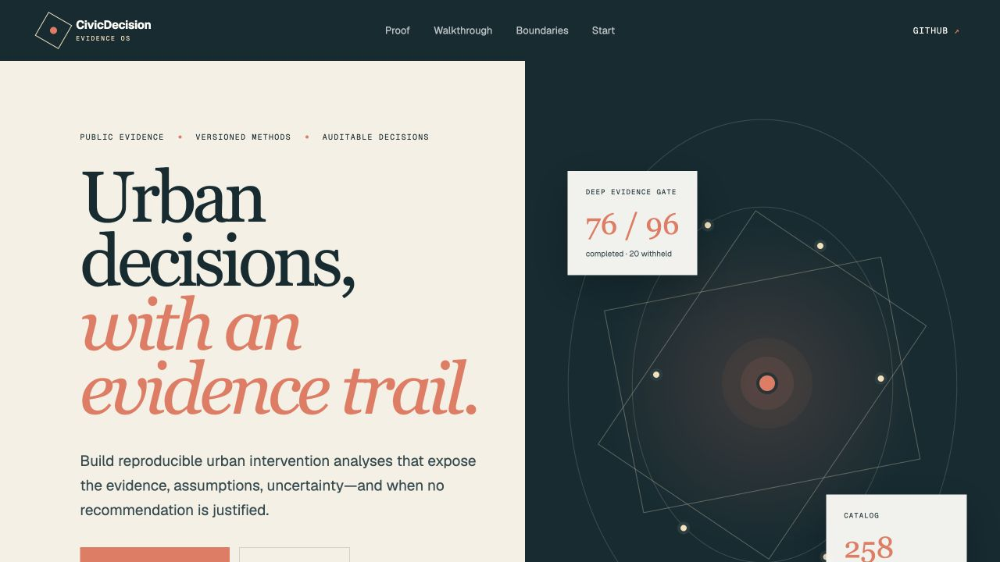

# Start with one decision, not the whole catalog

CivicDecision OS helps urban analysts and civic data teams produce reviewable intervention
screens whose evidence, assumptions, uncertainty, and release gate remain visible. It can also
preserve an infeasible or insufficient-evidence result instead of forcing a recommendation.

[Open the public walkthrough](https://civicdecision-os.limingrui2.chatgpt.site){ .md-button .md-button--primary }
[View the repository](https://github.com/limingrui679-design/civicdecision-os){ .md-button }



## Choose your route

| If you want to… | Start here | Expected result |
|---|---|---|
| Understand the product without installing it | [Public walkthrough](https://civicdecision-os.limingrui2.chatgpt.site) | A read-only evidence-gate and reference-case tour |
| Generate and verify an artifact | [Build your first DecisionPack](tutorials/FIRST_DECISIONPACK.md) | Completed and deliberately infeasible golden outputs |
| Define a city without overstating readiness | [Add and validate a city](tutorials/ADD_A_CITY.md) | A schema-valid adapter with explicit data gaps |
| Author an intervention question | [Build and review a scenario](tutorials/BUILD_REVIEW_SCENARIO.md) | A schema-valid scenario and review checklist |
| Integrate the validated snapshot | [REST API](API.md) or [Python SDK](SDK.md) | Read-only typed product resources |
| Audit the current claims | [Status](STATUS.md) and [Claim audit](CLAIM_AUDIT.md) | Requirement-to-evidence and public-state checks |

## Five-minute local setup

```bash
git clone https://github.com/limingrui679-design/civicdecision-os.git
cd civicdecision-os
python -m venv .venv
. .venv/bin/activate
python -m pip install -e '.[api]'
civicdecision serve --root . --host 127.0.0.1 --port 8000
```

Open `http://127.0.0.1:8000/`. The server binds only to loopback unless you explicitly
acknowledge a network bind. That acknowledgement does not add authentication, TLS, quotas, or
authorization.

## Read the numbers correctly

The current v0.8.0 snapshot exposes 258 highest-available city records, 240 scenario designs, 98
DecisionPacks, and 800 passing tests. These establish catalog scope and implementation behavior.
They do **not** establish municipal deployment, adoption, external review, causal impact, or
policy effectiveness.

The deep evidence gate completed 76 of 96 executions and withheld 20. This is written as counts,
not as an accuracy or success percentage.

## Core release rule

```text
evidence and source versions
  -> typed analytical run
  -> hard constraints and diagnostics
  -> reversal and value-of-information tests
  -> completed DecisionPack or auditable negative release
```

!!! note "A negative release is a product result"
    An infeasible or insufficient-evidence output retains its failure reason, diagnostics, source
    lineage, and next evidence needs. It is not silently discarded.
